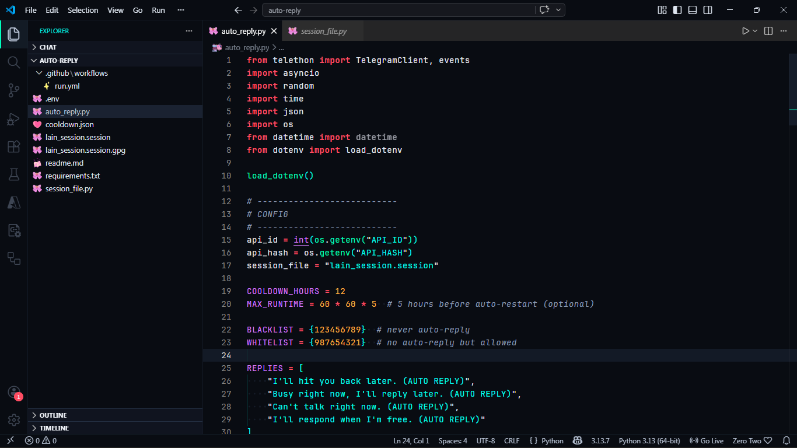
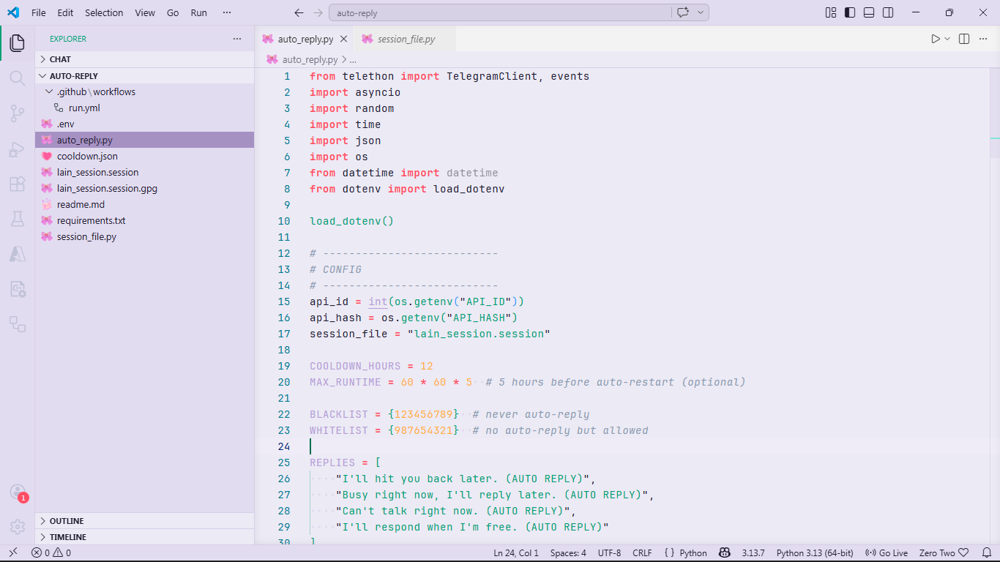
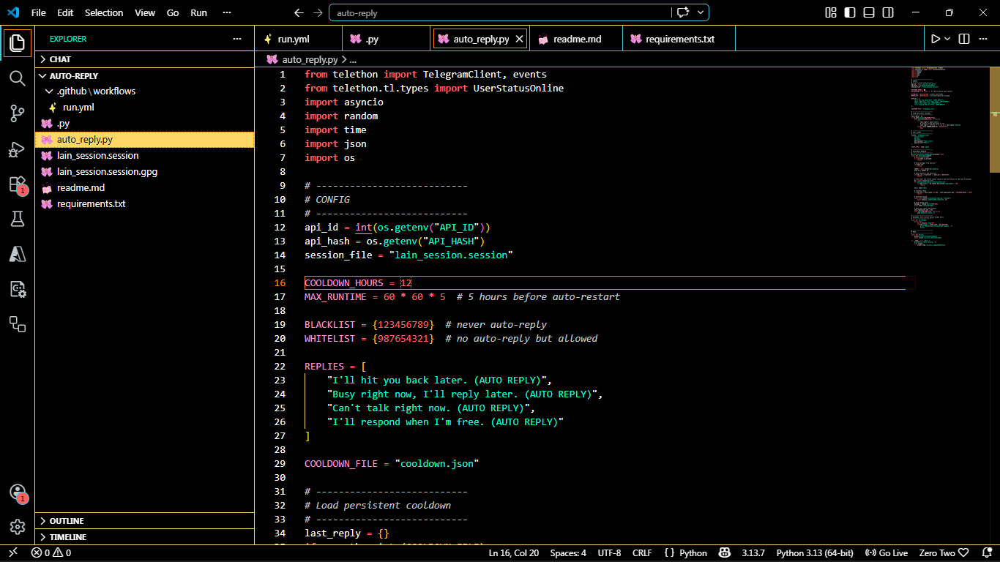

# Lain Theme

Gothic horror / Serial Experiments Lain inspired theme for VS Code.  
Dark, light, and high-contrast variants.

---

## Preview

### Dark


### Light


### High Contrast


---

## Install

1. Open VS Code, go to Extensions (`Ctrl+Shift+X`).
2. Search for `Lain Theme`.
3. Click Install, then `Ctrl+K Ctrl+T` to select a theme.

Or install from VSIX:
Extensions → … → Install from VSIX…

---

## Build from source

```bash
git clone https://github.com/yourusername/lain-theme
cd lain-theme
```
```bash
npm install
npm run build
```
The generated themes are in themes/.
Use F5 in VS Code to test, or copy the folder to ~/.vscode/extensions/.
Colors
Base palette (12 colors)

Black — (`#0B0B0F`)

Dark purple — (`#1E1A2B`)

Purple — (`#322A45`)

Light purple — (`#5E4B73`)

Ghost white — (`#F0EAF0`)

CRT green — #B5E5B5

Blood red — #8B2C2C

Dark red — #5A1E1E

Gray — #808080

Light gray — #C0C0C0

Deep blue (light theme) — #1A1A2E

High-contrast accents

Neon yellow — #FFFF00

Pink — #FF55FF

Red — #FF5555

Green — #55FF55

All combinations meet WCAG contrast requirements.
