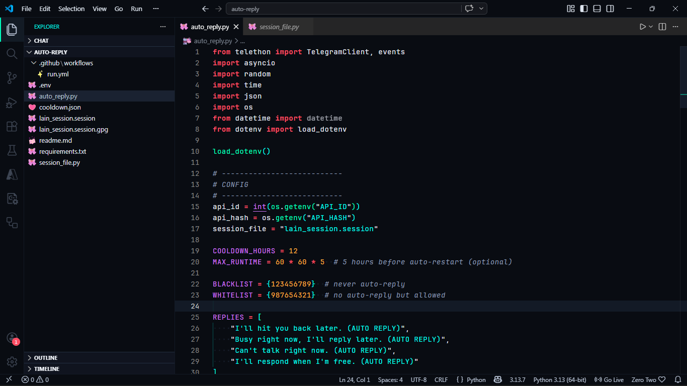
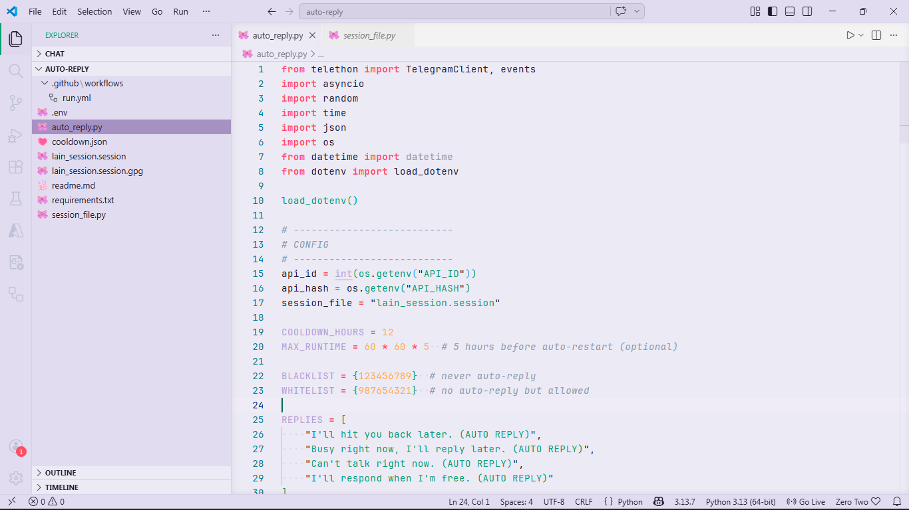
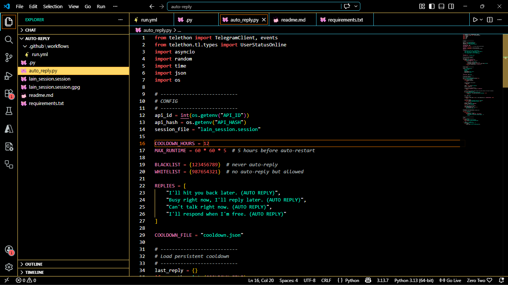

# Lain Theme

Serial Experiments Lain inspired theme for VS Code.  
Dark, light, and high-contrast variants.

---

## Preview

### Dark


### Light


### High Contrast


## Installation

### Install from VSIX file (no build required)

Download [lain-theme-2.3.1.vsix](https://github.com/Haymawon/lain_theme/releases/tag/v2.3.1) and run:

```bash
code --install-extension lain-theme-2.3.1.vsix
```

Restart VS Code and select the theme via File > Preferences > Color Theme (Ctrl+K Ctrl+T).

### Recommended settings
Add to settings.json:
```
 "workbench.colorTheme": "Lain (Dark)",
  // ----- Custom Fonts (from assets/fonts) -----
  // After installing the font files, use the exact font family name.
  // Placeholders: "LainFont-Regular", "LainMono", "LainCode"
  "editor.fontFamily": "JetBrainsMonoNL Nerd Font Propo",
  "editor.fontLigatures": true,
  "editor.fontSize": 14,
  "editor.lineHeight": 1.6,
  "editor.letterSpacing": 0.5,
  
  // ----- Terminal font (optional) -----
  "terminal.integrated.fontFamily": "JetBrainsMono Nerd Font Mono",
  "terminal.integrated.fontSize": 13,
  
  // ----- Editor enhancements -----
  "editor.cursorStyle": "line",
  "editor.cursorBlinking": "phase",
  "editor.renderWhitespace": "boundary",
  "editor.renderLineHighlight": "all",
  "editor.smoothScrolling": true,
  "editor.minimap.enabled": false,
  "editor.scrollBeyondLastLine": false,
  
  // ----- Workbench appearance -----
  "workbench.iconTheme": "vscode-celestial-magic-girl-icon-theme",   // or your preferred icon theme
  "workbench.tree.indent": 16,
  "workbench.startupEditor": "none",
  
  // ----- Files & Explorer -----
  "files.autoSave": "onFocusChange",
  
  // ----- Breadcrumbs -----
  "breadcrumbs.enabled": true,
  "breadcrumbs.filePath": "on",
  
  // ----- Extras -----
  "editor.guides.bracketPairs": true,
  "editor.guides.indentation": true,
"editor.matchBrackets": "always"
```

# Check for Updates

The extension has a manual update check. Run it to see if a newer version is out.

## How to use
Open VS Code.

Open the Command Palette:

Windows/Linux: `Ctrl + Shift + P`

Mac: `Cmd + Shift + P`

Type `Lain: Check for Updates` and press Enter.

The extension will tell you if an update exists.

## Warning
Don't run `Lain: Check for Updates` **inside a terminal or command prompt.** It's a **VS Code command, not a system command.**

This will not work:

`C:\Users\username>Lain: Check for Updates`
That just gives an error. Run it **only from VS Code's Command Palette.**

## How to update
If a newer version is available:

Download the latest `.vsix` file from the project's releases page.

Then install it in VS Code:

### Option 1 — Command Palette

Open Command Palette `(Ctrl+Shift+P)` choose Extensions: Install from VSIX, and pick the downloaded file.

### Option 2 — Terminal
Run this in your terminal:

`code --install-extension extension-name.vsix`
The new version will replace the old one automatically.


# Build from source
Prerequisites: Node.js (v14 or later), Git.

```bash
git clone https://github.com/Haymawon/lain_theme.git
cd lain_theme
npm install          # installs @vscode/vsce
node build.js        # generates theme JSON files in themes/
node validate.js     # (optional) checks contrast ratios
npx vsce package     # creates lain-theme vsix
```
Then install the .vsix as shown above.

### Verify contrast (optional)
```bash
node validate.js
```
Manual theme generation (without packaging)
```bash
node build.js
```
Themes are written to themes/lain-dark.json, themes/lain-light.json, themes/lain-high-contrast.json. Copy them manually if needed.

License
[GPL-3.0 License.](https://github.com/Haymawon/lain_theme/blob/main/LICENSE)
